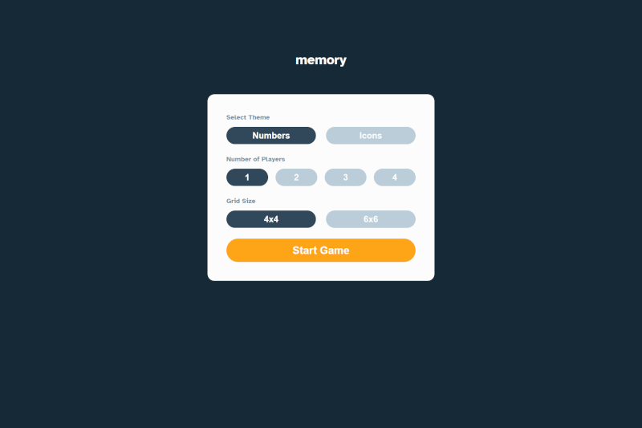
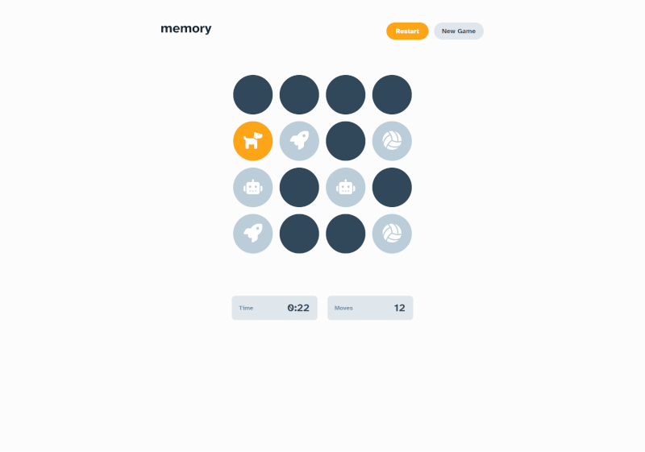
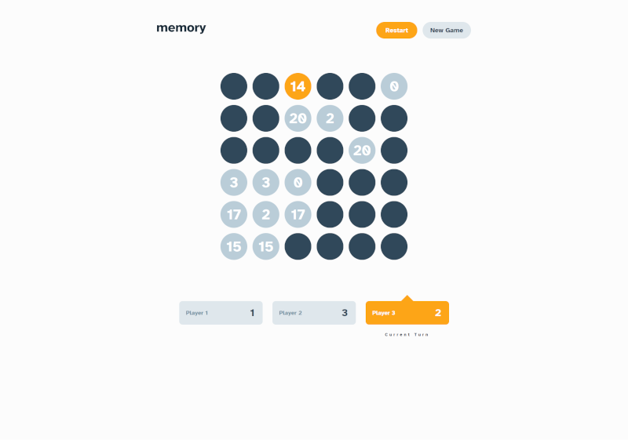

# Memory Game
Try to match pairs! Solo or multiplayer (up to 4 Players) game. Set the theme to use numbers or icons within the tiles. Choose to play on either a 6x6 or 4x4 grid.

# Live View:
- https://memory.litewskidev.usermd.net

# Build with:
HTML5 ∙ JavaScript ∙ SASS ∙ RWD

# Layouts:
Mobile ∙ Tablet ∙ Desktop

# Preview:

